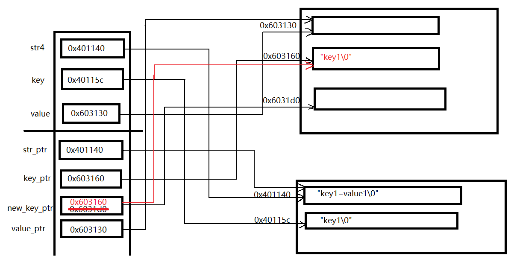

# C语言学习笔记


# 1.热身

断层思维

1.`sck_client_v1.h`

```c
#ifndef _SCK_CLIENT_H_V1_
#define _SCK_CLIENT_H_V1_
#endif


// 客户端环境初始化
int sck_client_init(void **handle);

// 客户端发送报文
int sck_client_send(void *handle, unsigned char *data, int datesize);

// 客户端接收报文
int sck_client_revc(void *handle, unsigned char *out, int *outsize);

// 客户端环境销毁
int sck_client_destroy(void *handle);


```

2.`sck_client_v2.h`

```c
#ifndef _SCK_CLIENT_H_V2_
#define _SCK_CLIENT_H_V2_


#ifdef __cplusplus
extern "C" {
#endif

// 客户端环境初始化
int sck_client_init(void **handle);

// 客户端发送报文
int sck_client_send(void *handle, unsigned char *data, int datesize);

// 客户端接收报文
int sck_client_revc(void *handle, unsigned char **out, int *outsize);

// 客户端环境销毁
int sck_client_destroy(void **handle);

#ifdef __cplusplus
}
#endif

#endif
```


数组做函数参数时, 会退化为指针, 并且需要把数组元素个数也传递过来.

```c
int func(int a[10]) --> int func(int a[]) ---> int func(int *a)
    
int func(int data[10], int datasize) --> int func(int *data, int datasize)
```


关于形参和实参

​	在函数调用的时候, 实参的值只是机械的传给形参

​	写在函数上的形参变量和写在函数里的变量, 从C/C++编译器角度看都是一样. 只不过函数上的形参变量具有对外的属性而已.


# 2.数据类型与变量

## 2.1.数据类型本质

```c
int main()
{
    int i; // 告诉C/C++编译器分配4个字节的内存
    int a[10]; // // 告诉C/C++编译器分配40个字节的内存
    printf("&a: %d, a: %d\n", &a, a);
    printf("&a+1: %d, a+1: %d\n", &a+1, a+1);
    printf("sizeof(&a): %d, sizeof(a): %d\n", sizeof(&a), sizeof(a));
}
```

数据类型: 

* 简单数据类型
* 复杂数据类型: 不能用简单数据类型的思维去考虑它. 如 **指针**, 结构体

**本质**: 是**固定大小的内存块的别名**. 

**作用**: 编译器给变量分配固定大小的内存空间

**别名**: `typedef int int32_t`

**大小**: `sizeof`操作符可以获取数据类型的大小, 在编译器编译期间就已经确定了.

**void类型**: 万能类型, 空类型, 可以表示任意一种类型


## 2.2.变量的本质
**变量的声明**： 
`声明器(declarator)`： 由标识符和它组合在一起的任何指针， 函数括号， 数组下标等

**解析声明方式**


`char *const *(*next)()`:
    next是一个指针， 它指向一个函数， 该函数返回一个指针， 指向一个类型为char的const指针

`char *(*c[10])(int **p)`:
    c是一个有10个元素的数组， 数组每一个元素是一个指针， 该指针指向一个函数，函数有一个指向int类型的指针做参数， 并返回一个指向char类型的指针


**变量本质 **: 是(一段连续)内存空间的别名, 内存空间的标号, 也就是门牌号,  通过它读写内存空间.

修改变量的方法:

* **直接修改**
* **间接修改**: 通过内存空间的地址编号

**小结**: 

* 1.对内存空间, 可读可写,
* 2.通过变量往内存空间读写数据, 不是向变量读写数据
* **变量跑到什么地方去了?**


# 3.内存四区模型

## 3.1.内存四区模型概述


* **栈区**: 也称为临时区, 由编译器自动分配释放, 存放函数的参数值, 局部变量的值等;
* **堆区**: 一般由程序员动态申请与释放, 若不手动释放, 可能会出现内存溢出问题
* **常量区/全局区和静态区**: 
  * **常量区**: 字符串常量和其他常量存放的地方;
  * **全局区和静态区**: 全局变量和静态变量存放的地方, 初始化过的全局变量和静态变量放在一块, 未初始化过的放一块; 在程序结束后由OS释放
* **代码区**: 存放函数体内的二进制指令;


```c
#include <stdio.h>
#include <string.h>
#include <stdlib.h>

char* get_str1()
{
  char *p = "abc";
  return p;

}

char* get_str2()
{
  char *p = "abc";
  return p;

}


char *get_str3()
{
  char buf[20];
  memset(buf, 0, sizeof(buf));
  strcpy(buf, "abc");
  return buf;

}

int main()
{
  char *p1 = NULL;
  char *p2 = NULL;
  char *buf = NULL;
  p1 = get_str1();
  p2 = get_str2();
  buf = get_str3();
  printf("&p1: %d\n", p1);
  printf("p1: %s\n", p1);
  printf("&p2: %d\n", p2);
  printf("p2: %s\n", p2);
  printf("&buf: %d\n", buf);
  printf("buf: %s\n", get_str3());
}
```


## 3.2.OS如何管理函数的调用


**问题**:

* 1.每个函数变量的生命周期如何?
* 2.main()函数中的变量(分配的内存), 在f1中可以使用吗?
  * **主调函数分配的内存(heap, stack, 全局区), 通过指针做函数参数可以再被调函数中使用**
* 3.在f1, f2中的变量, 在main中可以使用吗?
  * **被调函数中分配的内存, malloc的内存, 全局区内存都可以让主调函数使用, 但是stack中的不可以.**


在被调函数中使用`malloc()`开辟的内存, 首地址传给调用函数的方式:

* 1.直接return
* 2.指针做函数参数


# 4.指针

## 4.1.铁律1

**指针也是一种数据类型, 有自己的内存空间, 用来保存它指向的变量的内存地址.**

 在32位机器中,大小为: 4, 在64位机器中, 大小为: 8;


## 4.2.铁律2

1.指针指向谁, 就把谁的地址赋给它.

2.*p操作内存有两种模式:

* 1.**写内存**: `*p= 10`: p指向谁, 就间接修改该变量的值

* 2.**读内存**: `a = *p`: 从p指向的内存空间, 读取数据赋值给a变量

  ***p**的意义: `*`号就像一把钥匙, 通过`p`这扇门去操作内存空间

```c
#include <stdio.h>
#include <stdlib.h>


int main()
{
  int a = 6, b=0;
  int *p = &a; // 指针p指向a, a的地址给赋值到p
  printf("&a: %d, &p: %d\n", &a, p);
  printf("a: %d, b: %d\n", a, b);
  *p = 10; // *p在=的左边, *p去间接修改a的值
  b = *p; // *p在=的右边, 从p指向的内存空间中读取数据赋值给b
  printf("a: %d, b: %d\n", a, b);
}

```

3.指针变量和它指向的内存空间是两个不同的概念, 

* 含义1: 给`p`赋值: `p=0x112233`, 只会改变指针变量的值, 并不会改变所指的内容; p++, 相当于指针指向了另一个变量 
* 含义2: 给`*p`赋值, `*p=123`, 不会改变指针变量的值, 只会改变所指的内存空间的值
* 含义3: `=左边*p`表示: 给内存赋值, `=右边*p`表示取值

4.指针是一种特殊的数据类型, 是指它指向的内存空间的数据类型. --->指针的步长, 根据所指的内存空间来决定

### 4.2.1.间接赋值

间接赋值是指针存在的最大意义

```c
int main()
{
    int a =0;
    int *p = &a;
    *p = 10;
    printf("a: %d\n", a);
}
```


1.**成立条件**:

* 条件1: 定义一个普通变量/实参(int, char, 数组, 结构体), 一个指针变量(形参)
* 条件2:  建立关联, p = &a, 实参取地址赋值给指针变量
* 条件3: 形参去间接的修改实参的值


2.应用场景

* 场景1: 在一个函数内. 通过不断修改指针变量的值实现字符串拷贝

  ```c
  int main()
  {
      char buf1[100]={0};
      char buf2[100]={0};
      char *p1 = NULL;
      char *p2 = NULL;
      strcpy(buf1, "abc123");
      
      p1 = buf1;
      p2 = buf2;
      while(*p1 !='\0')
      {
          *p2++ = *p1++;
      }
      *p2 = '\0'
  }
  ```

* 场景2: 在两个函数之间

  ```c
  /*
  结论:
      通过1级指针(形参)可以间接修改0级指针(实参)的值
      通过2级指针(形参)可以间接修改1级指针(实参)的值
      通过3级指针(形参)可以间接修改2级指针(实参)的值
  */
  
  void change_num(int *p)
  {
      *p = 100; // 形参间接修改了实参的值
  }
  int main()
  {
      int a =0; // a可以看做是0级指针
      int *p = &a; // p可以看成是1级指针
      *p = 10;
      printf("a: %d\n", a);
      change_num(&a);
      printf("a: %d\n", a);
  }
  ```

  

3.三个条件的组合: 会产生3中不同的语法现象

* 组合1: 条件1, 2, 3 都写在一个函数;
* 组合2: 条件1, 2在一个函数内,  条件3写在另一个函数;
* 组合3: 条件1写在一个函数内, 条件2, 3写在另一个函数;


## 4.3.铁律3

**理解指针必须和内存四区概念相结合**

如何理解指针做函数参数的API: **主调函数分配内存地址, 并把地址传递给被调函数**

主调函数 与 被调函数:

* 主调函数可以把堆区, 栈区, 全局区数据的内存地址传递给被调函数
* 被调函数只能返回堆区, 全局数据, 栈区的数据在被调函数执行完毕后被释放

内存分配方式:

* 指针做函数参数, 具有**输入和输出**特性


被调函数分配内存,  并把内存首地址返回出来的方式

* 方法1: 直接return p
* 方法2: 指针做函数参数

```c

// 1.直接return p
char* get_buff1()
{
    char *p = (char*)malloc(128);
    return p;
}

// 2.指针做函数参数
void get_buff2(void **p)
{
    char* buf="abc";
    p = &buf;
}

int main()
{
    char *p1 = get_buff1();
    char *p = (char*)malloc(128);
    get_buff2((char*)p)
    
}
```


## 4.3.不断修改指针变量易犯错误

1.在一个函数中的场景:

```c
#include <stdio.h>
#include <string.h>
#include <stdlib.h>


int main()
{
  char *p, *p_head = NULL;
  p_head = p = (char*)malloc(100);
  strcpy(p, "1234567890");

  p = p+3; // 修改指针指向
  *p = 'a';
  printf("p: %s\n", p);
  free(p_head); // 释放的内存空间必须是通过首地址
  p_head=NULL;
  p=NULL;
}
```


# 5.指针与数组

## 5.1.数组和指针相同的规则

数组和指针的关系：


**注意**： 数组和指针在编译器编译时是不同的， 在运行时的表示形式也是不同的。对编译器而言：

* 一个数组就是一个地址
* 一个指针就是一个地址的地址

**数组和指针不相等的情况下， 定义和声明必须匹配。如果定义了一个数组， 在其他文件对他进行声明时也必须把它声明为数组， 指针也是如此。**


**规则1**：

**表达式中的数组名就是指针**： `a[i] ---> *(a+i)`, 在编译时， 对于数组表达式， 编译器会把`a[i]`编译成 `*(a+i)`的形式

* 在表达式中， 指针和数组是可以互换的， 因为在编译器里的最终形式都是指针， 并且都可以进行区下标操作。
* 编译器自动把下标值的步长调整到数组元素的大小。对起始地址执行加法操作前， 编译器会负责计算每次增加的步长。
* 每个指针只能指向一种类型的原因就是：编译器需要知道对指针进行解除引用操作时应该取几个字节， 以及每个下标的步长是几个字节。

**规则2**：

**C语言把数组下标作为指针的偏移量**

C语言把数组下标改写成指针偏移量的根本原因是**指针和偏移量是底层硬件所使用的基本类型**。


**规则3**：

**作为函数参数的数组名等同于指针**

更倾向于把函数参数定义为指针， 因为这是编译器内部使用的方式。

**数组名是可能被修改的左值， 因此这只能在指针里完成。**

```c
#include <stdio.h>


int arr1[100];
int arr2[100];

void f1(int *ptr)
{
  ptr[1] = 3;
  *ptr = 3;
  printf("ptr[0]: [%d], ptr[1]: [%d]\n", ptr[0], ptr[1]);
  ptr = arr2;
  printf("ptr[0]: [%d], ptr[1]: [%d]\n", ptr[0], ptr[1]);

}

void f2(int arr[])
{
  arr[1] = 3;
  *arr = 3;
  printf("arr[0]: [%d], arr[1]: [%d]\n", *arr, *arr++);
  arr = arr2; // arr实际是一个指针
  printf("arr[0]: [%d], arr[1]: [%d]\n", *arr, *arr++);

}

void main()
{

  arr1[1] = 3;
  *arr1 = 3;
  //arr1 = arr2; // compiler error: assignment to expression with array type
  f1(arr1);
  f2(arr1);

}
```


# 5.字符串操作

C语言中没有字符串类型, 是通过数组来模拟实现, 并且在元素末尾添加`\0`来结束

字符串可以分配在 全局区, 堆区, 栈区.


## 5.1.strcpy推演

```c
void copy_str1(char* dest, const char* src)
{
    for(; *src != '\0'; dest++, src++)
    {
        *dest = *src;
    }
    *dest='\0';
}

void copy_str2(char* dest, const char* src)
{
    while(*src != '\0')
    {
        *dest = *src;
        src++;
        dest++;
    }
    *dest='\0';
}

void copy_str3(char* dest, const char* src)
{
    while(*src != '\0')
    {
        *dest++ = *src++;
    }
    *dest='\0';
}


void copy_str4(char* dest, const char* src)
{
    while(*dest++ = *src++)
    {
        ;
    }
}

int main()
{
    char *p="abc";
    //char *p2=NULL; // 不会开辟内存空间
    char p2[10];
    copy_str1(p2, p);
}
```


## 5.2.strstr推演

`strstr`: 查找子串在字符串中第一次出现的位置

```c
#include <stdio.h>
#include <stdlib.h>
#include <string.h>


/*
 * 重要思想:
 * 1.引入辅助指针变量
 * 2.辅助指针变量和操作逻辑之间的关系
 *
 * */

int sub_str_cnt(const char *str, const char *sub_str, int *count)
{
    int ret_val = 0;
 	// 不要相信别人传递的内存是可用的
    if (str == NULL || sub_str == NULL || count == NULL)
    {
        ret_val = -1;
        printf("func sub_str_cnt() Error: str == NULL || sub_str == NULL || count == NULL\n");
        return ret_val;
    }
    while(*str != '\0')
    {
        str = strstr(str, sub_str);
        printf("str: %s\n", str);
        if (str == NULL)
            break;
        else
        {
            (*count)++; // ++优先级高于*
            str+=strlen(sub_str);
        }
    }
    return ret_val;
}


int main()
{
    int count=0;
    char *str = "abcd11123abcd22223abcd";
    char *sub_str="abcd"
    int ret = sub_str_cnt(str, sub_str, &count);
	if (ret != 0)
    {
        printf("err: ", ret);
        return;
    }
    printf("cnt: %d\n", count);
}

```


## 5.3.trim_space
截取字符串首尾两端的空格，并返回新生成的字符串.

```c
// 去除字符串首尾的空格, 并返回新的字符串
int trim_space(const char *src, char *dest)
{
  int ret_val = 0;
  char *src_begin_ptr = src;
  char *src_end_ptr = src + strlen(src) -1;
  char *dest_ptr = dest;
  if (src == NULL || dest ==  NULL)
  {
    ret_val = -1;
    printf("func trim_space() error: (src_ptr == NULL || dest_ptr ==  NULL)");
    return ret_val;
  }
  if(*src_begin_ptr != ' ' && *src_end_ptr != ' ') 
  {
    // dest = src; // 改变了dest的地址， 此时dest指向src的内存空间
    strcpy(dest, src);
    return ret_val;
  }

  while(*src_begin_ptr != '\0')
  {
    if (*src_begin_ptr != ' ')
      break;
    src_begin_ptr++;
  }
  while(*src_end_ptr != '\0')
  {
    if(*src_end_ptr != ' ')
      break;
    src_end_ptr--;
  }
  while (src_begin_ptr != src_end_ptr)
  {
    *dest_ptr++=*src_begin_ptr++;
  } 
  *dest_ptr = *src_end_ptr;
  return ret_val;
}

```
**易犯错误**：容易修改指针的指向
